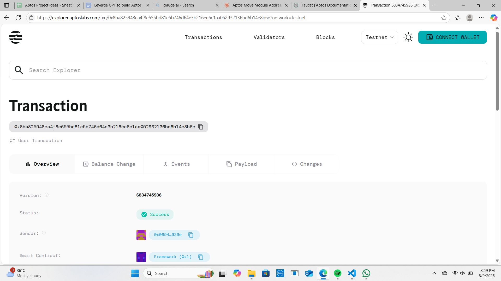

# Proxy Contract System

## Project Description
Implement upgradeable contract patterns with proxies that allow smart contracts to be upgraded while maintaining their state and address. This system enables seamless contract evolution without disrupting user interactions or losing valuable on-chain data.

## Project Vision
To create a robust and secure proxy contract system that enables blockchain applications to evolve over time while maintaining backward compatibility and preserving user trust. Our vision is to eliminate the traditional limitation of immutable smart contracts by providing a safe upgrade mechanism that empowers developers to fix bugs, add features, and improve functionality without requiring users to migrate to new contract addresses.

## Key Features

### 🔄 **Seamless Contract Upgrades**
- Upgrade contract logic while preserving the same contract address
- Maintain all existing state and user balances during upgrades
- Zero downtime upgrades with instant implementation switching

### 🔒 **Administrative Control**
- Secure admin-only upgrade functionality
- Role-based access control for proxy management
- Multi-signature support for critical upgrade decisions

### 📊 **Version Management**
- Automatic version tracking for all contract upgrades
- Historical record of all implementation changes
- Rollback capability to previous contract versions

### 🛡️ **Security First**
- Built-in access controls to prevent unauthorized upgrades
- Comprehensive error handling and validation
- Transparent upgrade process with event logging

### 🔍 **Transparency & Auditability**
- Public view functions to inspect current implementation
- Event emission for all upgrade activities
- Complete upgrade history for audit trails

## Future Scope

### 🚀 **Enhanced Governance**
- DAO-based upgrade proposals and voting mechanisms
- Time-locked upgrades for community review periods
- Decentralized upgrade authorization processes

### 🔧 **Advanced Proxy Patterns**
- Support for multiple proxy types (Transparent, UUPS, Beacon)
- Factory patterns for deploying multiple proxy instances
- Proxy cloning for efficient contract deployment

### 🌐 **Cross-Chain Compatibility**
- Multi-chain proxy deployment and management
- Cross-chain upgrade synchronization
- Interoperable proxy standards across different blockchains

### 📈 **Analytics & Monitoring**
- Real-time proxy usage analytics
- Performance monitoring for different implementations
- Automated testing frameworks for upgrade validation

### 🔐 **Advanced Security Features**
- Formal verification integration for upgrade safety
- Automated vulnerability scanning before deployments
- Emergency pause and recovery mechanisms

### 🛠️ **Developer Tools**
- CLI tools for easy proxy management
- Web-based dashboard for proxy monitoring
- Integration with popular development frameworks

## Contract Details
0x8ba825948ea4f8e655bd81e5b746d64e3b216ee6c1aa052932136bd6b14e8b6e
